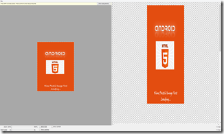
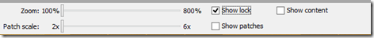
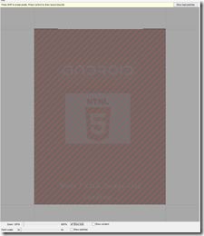
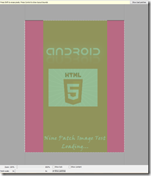
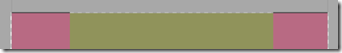
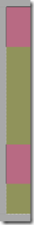
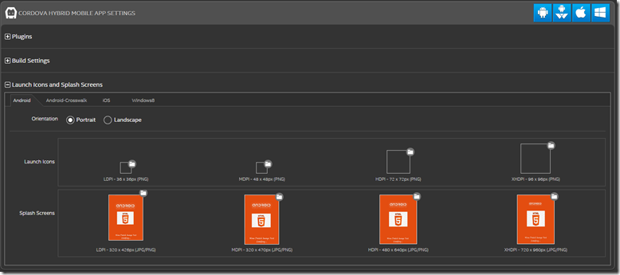
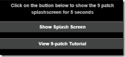

The source code for this sample can be found here: [https://github.com/gomobile/sample-9-patch-splash-screen](https://github.com/gomobile/sample-9-patch-splash-screen)_, or download the [Intel® XDK](http://software.intel.com/html5) to check out all the HTML5 Samples._

This sample demonstrates how to use 9-patch PNG images for Android* splash screens within Intel XDK. Developers must keep in mind that their app should cater to different screen sizes and orientations. Android* apps can solve this problem by using 9-patch PNG images that can have stretchable areas defined such that the image can be stretched without compromising the end result.

**What are 9-patch images?**

Nine-patch graphics is a stretchable bit map image. Android* automatically resizes your 9-patch image to accommodate changes in resolution and specific layout constraints. When you create a 9-patch image, you can configure how the image should be stretched if it needs to be resized. It must be saved with the extension ‘.9.png’.

**When should they be used?**

9-patch images can be used for button backgrounds, page backgrounds, splash screens etc. For example, buttons must stretch to accommodate strings of various lengths. Splash screens often contain images or text that look contorted and pixilated on resolution changes.

* * *

#### **9-patch Tutorial using Draw 9-patch tool for Intel XDK splash screen**

**Create four PNG images of your splash screen:**

Due to varied screen sizes and resolutions of Android* devices in the market, Android* has separated all of its screen sizes into 4 distinct screen densities:

*   Low Density (ldpi ~ 120dpi)
*   Medium Density (mdpi ~ 160dpi)
*   High Density (hdpi ~ 240dpi)
*   Extra-High Density (xhdpi ~ 320dpi) 

*> *Note: These dpi values are approximations, since custom built devices will have varying dpi values.**

You will have to create 4 png images of your desired splash screen for each of the following screen density:

<table align="left">

<thead>

<tr>

<th scope="col" style="text-align: left;">Density                                            </th>

<th scope="col" style="text-align: left;">Width                                            </th>

<th scope="col" style="text-align: left;">Height                                           </th>

</tr>

</thead>

<tbody>

<tr>

<td>ldpi (Small)</td>

<td>320</td>

<td>426</td>

</tr>

<tr>

<td>mdpi (Medium)</td>

<td>320</td>

<td>470</td>

</tr>

<tr>

<td>hdpi (Large)</td>

<td>480</td>

<td>640</td>

</tr>

<tr>

<td>xhdpi (XLarge)</td>

<td>720</td>

<td>960</td>

</tr>

</tbody>

</table>

*Note: The splash screen resolutions specified above, and on the Icons and Splash Screens section of the **Projects** tab, are **minimum** recommended dimensions, not **absolute** required dimensions.*

Differing screen sizes, widescreen, orientation are all factors that contribute to the image stretching to fit the screen. So your only options are to either create an image for each screen size/density combination, or create four 9-patch images. Once these four images have been converted to 9-patch, Android* will select the appropriate file for the device’s image density and then stretch the image according to the the device standard. If you choose to design a splash screen for every single resolution, you can start by following the resolutions in the table at the end of [this](http://developer.android.com/guide/practices/screens_support.html#testing) page.

> Note: If you choose to create just one 9-patch image of size 720x960, you have to note that 9-patch images only **stretch** and not **shrink**. While it may look great on a tablet, displaying it on a standard mobile device of size 320x470, text and other elements will look very small and lose legibility. To ensure that no shrinking will occur, you have to design in the lowest common resolution for each density category.

In the sample, you will find two sets of images (NinePatchSplashScreen/www/images) – four original images ending with .png and their 9-patch counterparts ending with .9.png.

**Convert each PNG splash screen image to 9-patch:**

We are going to be using the Draw 9-patch tool from Android* to do this.

> Note: Any PNG image editor that can mark pixels in a transparent color can be used.

**Step 1:** Launch Tool. Draw9patch.bat is part of [Android* SDK](https://developer.android.com/sdk/index.html) and can be launched from the sdk/tools folder. 

**Step 2:** Import your PNG image to the tool by either dragging it into the window or locate the file using Ctrl+O.

           

**Step 3:** Analyze your image and decide which areas you want to preserve (make non-scalable) and which areas you would like to stretch (will distort).

Here is what the original image looks like:

   

Here is how it will look like when the device stretches it vertically and horizontally (this can be viewed on the preview area – right pane of the tool)

   

          

We want the HTML5 logo to be centered in the middle, the ‘**android**’ text above the logo and the ‘**Nine Patch Image Test Loading…**’ text at the bottom of the image. This leaves the areas in grey open for stretching:

**Step 4:** Specify areas for stretching in Draw 9-patch tool.

Check the ‘Show lock’ Checkbox (found at the bottom pane of the tool). When you mouse over, it will show you the non-drawable area of the image. You will find a small one pixel perimeter around the image where you can draw a line to specify areas you want to stretch.

Check the ‘Show patches’ checkbox which shows the stretchable patches in pink on the image. Click within the 1 pixel perimeter to draw lines that define the stretchable patches. **Draw lines only on the top and left borders**. The pink patch areas will be stretched if the splash screen needs to be resized.

On the preview pane, you can see how your 9-patch image now looks when stretched vertically and horizontally:

Much better.

**Step 5:** Save 9-patch image (File > Save 9-patch) which would save it with the .9.png extension. Android* will identify your image as a nine-patch graphic using this extension so do not change it.

**Step 6:** Create three more 9-patch images for your other image sizes.

*   small (ldpi): 320x426
*   medium (mdpi): 320x470
*   large (hdpi): 480x640
*   xlarge (xhdpi): 720x960

**Step 7:** Add your 9-patch images to your project directory from which Intel XDK is reading from. Ensure that the Cordova* Splash screen plug-in has been selected from the projects tab.

Go to the Projects tab of your app > Cordova* Hybrid Mobile App Settings > Launch Icons and Splash screens > Add your splash screens by using the little folder icon to locate them.

In init-app.js, your auto generated code will call the hideSplashScreen() method.

<pre class="code-simple" style="text-align: justify;">app.hideSplashScreen() ;    // after init is good time to remove splash screen</pre>

The splash screen plug-in removes the splash screen after the default timeout or the hideSplashScreen() function is called, whichever comes first. You can increase the default timeout via the intelxdk.config.additions.xml file:

	<!-- "value" is the minimum time, in milliseconds, to show the launch or splash screen -->
	<preference name="SplashScreenDelay" value="2000" /></pre>

In the sample, the hideSplashScreen method has been commented to display the splash screen for a longer period of time.

The ‘Show Splash Screen’  button will display the splash screen for 5 seconds.

You can modify the duration by changing the timeout in milliseconds in index_user_scripts.js:

<pre class="brush:xml;" style="text-align: justify;">if (navigator.splashscreen) {
    navigator.splashscreen.show();
    setTimeout(function () {
        navigator.splashscreen.hide();
    }, 5000);
}</pre>

Run the app on a variety of devices to see how different screen sizes and aspect ratios change the splash screen to see the difference nine-patch images make.

> Note: You can run this app in the Emulator or using the Debug and Test tabs, but you will not see the custom splash screens. You must build and install the app on an Android* device to see the custom splash screen.

* * *

References:

*   [http://developer.android.com/tools/help/draw9patch.html](http://developer.android.com/tools/help/draw9patch.html "http://developer.android.com/tools/help/draw9patch.html")
*   [http://developer.android.com/guide/topics/graphics/2d-graphics.html#nine-patch](http://developer.android.com/guide/topics/graphics/2d-graphics.html#nine-patch "http://developer.android.com/guide/topics/graphics/2d-graphics.html#nine-patch")
*   [http://radleymarx.com/blog/simple-guide-to-9-patch/](http://radleymarx.com/blog/simple-guide-to-9-patch/ "http://radleymarx.com/blog/simple-guide-to-9-patch/")
*   [http://stackoverflow.com/questions/10574363/android-splash-screen-image-sizes-to-fit-all-devices](http://stackoverflow.com/questions/10574363/android-splash-screen-image-sizes-to-fit-all-devices "http://stackoverflow.com/questions/10574363/android-splash-screen-image-sizes-to-fit-all-devices")
*   [https://software.intel.com/en-us/xdk/docs/cordova-for-android-build-options](https://software.intel.com/en-us/xdk/docs/cordova-for-android-build-options)